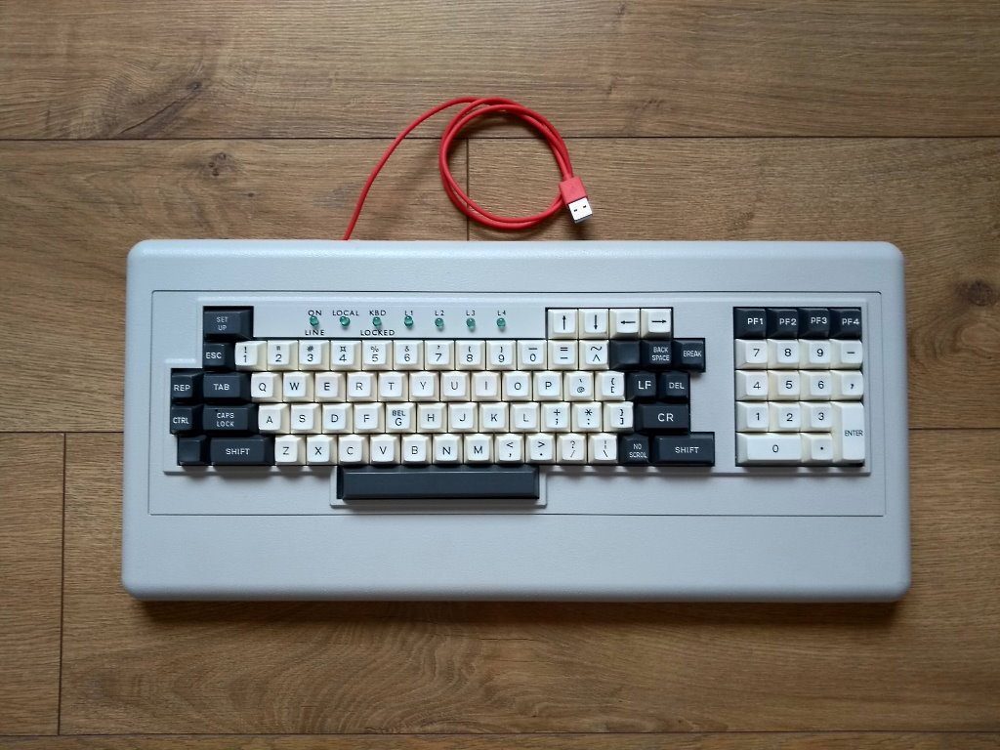
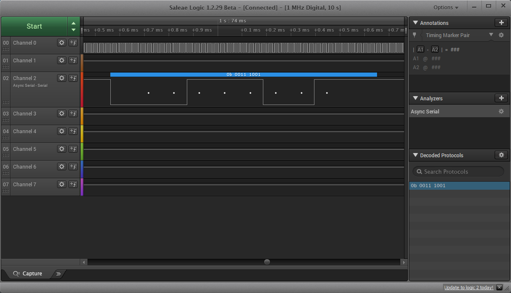
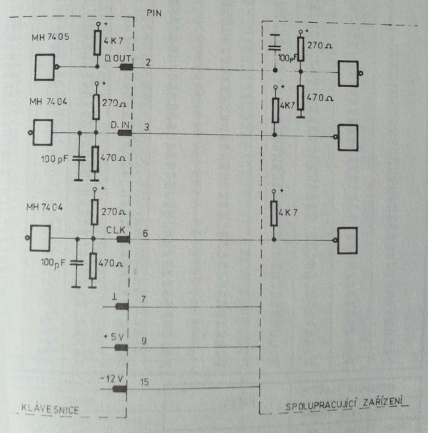
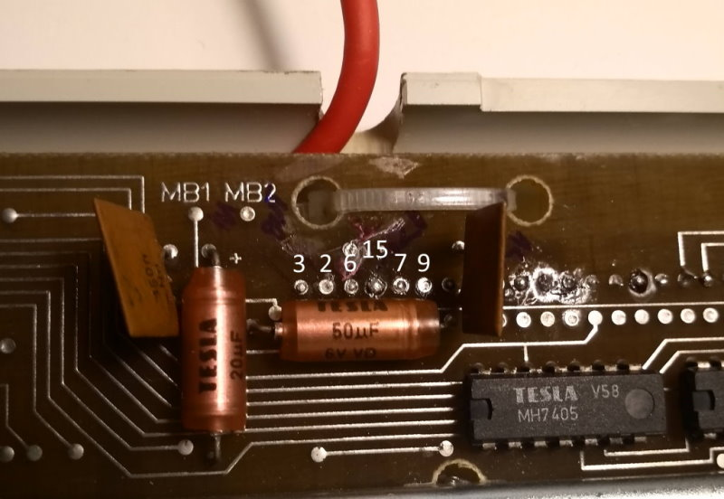

# Consul-262.5 Conversion



Consul 262.5 is an eternal mechanical keyboard using hall-effect switches. The keyboard communicate via UART, so the input and output data is in serial format.
The keyboard sends an ascii character to the output with following protocol: 
 - 1x start bit, 8x data bit, 2x stop bit
 - there is no parity
 - the data bits are reversed (MSB first) and inverted      

e.g. character 'c' is 0x63 (0b_0110_0011). On the output you get 0b_0011_1001, which reversed and inverted is 0b_0110_0011:
  

For the conversion I've used Pro Micro 32u4 micro-controller and some cheap step-up voltage inverter. 
Pro Micro is connected via TX/RX pins and A9 as Clock signal:
```text
    USB
     +
     |
     |
+----v-------+               +------------+
| Pro Micro  |               | Step-up    |
| 5V         |               | Voltage    |
|            |               | Inverter   |
|------------|               |------------|
|        +5V +------+--------+ +5V(IN)    |
|        GND +--+---|--------+ GND        |
|TX  RX  A9  |  |   |    +---+ -12V(OUT)  |
+-+---+---+--+  |   |    |   +------------+
  |   |   |     |   |    |
  |   |   |     |   |    |
  |   |   |     |   |    |
+-+---+---+-----+---+----+----------------+
| 3   2   6     7   9   15                |
| IN OUT CLK   GND +5V -12V               |
|-----------------------------------------|
| Consul 262.5                            |
+-----------------------------------------+
```
The connection schematics from the keyboard manual:



The pinouts on the PCB:



And some code:
```
#include <Keyboard.h>;

void setup()
{
  Serial1.begin(9600, SERIAL_8N2);
  
  TCCR1B = 0x18; // 0001 1000, Disable Timer Clock 
  TCCR1A = 0x50; // 0101 0000
  
  ICR1 = 52-1; // Low Phase Shift Resolution > 1 degree step-size 
  OCR1A = (int) (ICR1 * 0,04);
  OCR1B = (int) (ICR1 * 0,50);
  TCNT1=0x0;
  
  pinMode(9, OUTPUT);  // OC1a
  pinMode(10, OUTPUT); // OC1b
    
  TCCR1B |= 1; // Prescale=1, Enable Timer Clock
}

void loop()
{
  int sr = Serial1.read();
  if(sr != -1) {
    int sra = ~sr & 0xff;
    Keyboard.write(sra);     
  }
}

```

Typing on the keyboard (:
[](https://youtu.be/cxvo7qaBsrE)

Controlling the leds:
[](https://youtu.be/4TuojVTcknU)

References:
 - [External link to Consul 262.5 Manual](https://consul.odkaznik.cz/_media/wiki:consul-262-5.pdf)
 - https://wait-state.blogspot.com/2019/11/cif.html (non-English info)
 - http://sapi.cz/prislusenstvi/c262-5.php (non-English info)
